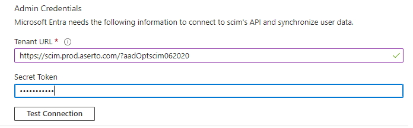
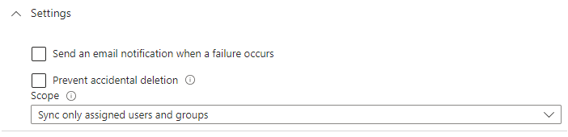
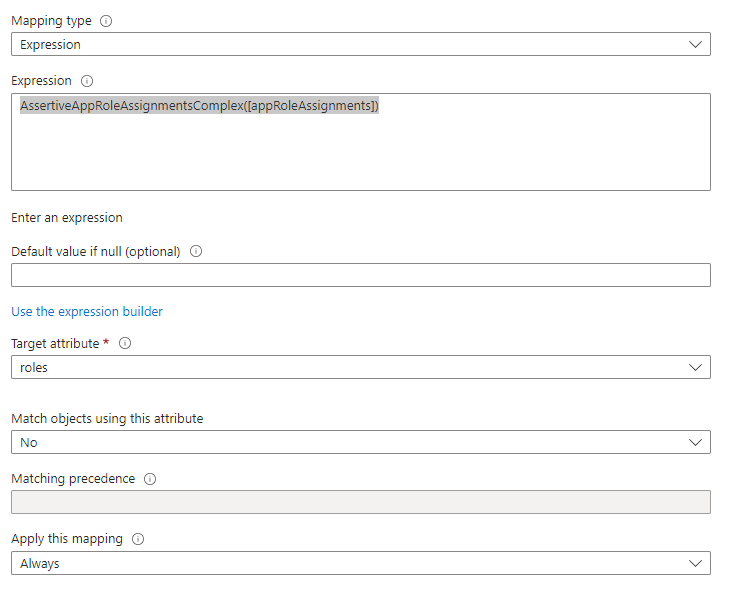

# Sync users from Entra ID (AzureAD)

## Create the SCIM application
To setup SCIM provisoning from Entra ID to Aserto, you need to create a new application in Entra ID. Please follow instructions on how to setup a new application:  https://learn.microsoft.com/en-us/entra/identity/app-provisioning/use-scim-to-provision-users-and-groups#getting-started

When creating the application, set Tenant URL to https://{scim-endpoint}/?aadOptscim062020. The `aadOptscim062020` feature flag is required for SCIM 2.0 compliance (see https://learn.microsoft.com/en-us/entra/identity/app-provisioning/application-provisioning-config-problem-scim-compatibility#flags-to-alter-the-scim-behavior)

For the secret token, enter the value configured in the `auth.bearer` config section.

## Provisioning users and groups
Once the application was created, users and groups can be assigned to this application. Once a user/group was assigned, it becomes available for provisioning.
To test the provisioning works, go to your SCIM app => Manage => Provisioning => Provision on demand, search for your user/group and click `Provision`
Please note that automatic provisioning might take some time to trigger, see https://learn.microsoft.com/en-us/entra/identity/app-provisioning/application-provisioning-when-will-provisioning-finish-specific-user#how-long-will-it-take-to-provision-users

## Provisioning roles
Only application specific roles can be provisioned. For this, the provisioning scope needs to be set to `Sync only assigned users and groups`

By default, roles are not mapped to any SCIM property. To add the mapping:
1. open your SCIM app, go to Manage => Provisioning => Mappings => open Provision Microsoft Entra ID Users => on the bottom, toggle Show advanced options => Edit attribute list for customappsso
2. on the bottom, add a new attribute called `roles`, type `String` and make sure `Multi-Value` is checked
3. back on the Attribute Mapping page, Add New Mapping:
    - Mapping type: `Expression`
    - Expression: `AssertiveAppRoleAssignmentsComplex([appRoleAssignments])`
    - Target attribute: select the new created attribute `roles`
    
    - click OK
4. Save attribute mappings

For more info on mappings, see https://learn.microsoft.com/en-us/entra/identity/app-provisioning/customize-application-attributes#provisioning-a-role-to-a-scim-app
